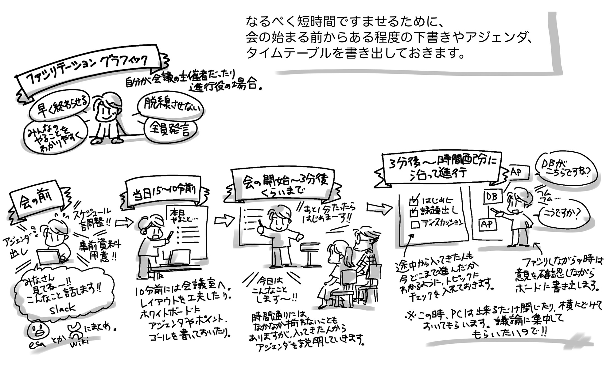
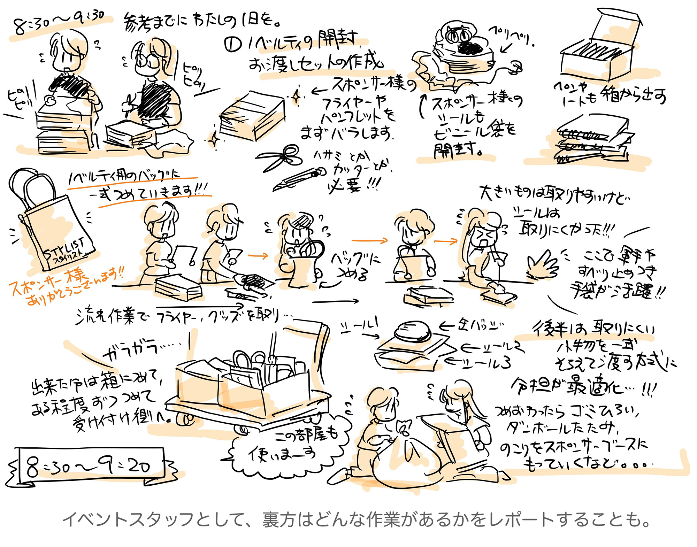

# ことばや線でもいいんです！描いてシェアして伝えてみよう！

## はじめに

こんにちは、たかのあきこ（@akiko_pusu）と申します。今回、ご縁あって寄稿の機会を頂戴いたしました。
最近はIT系のイベントで、グラフィックレコーディングを使って様子を伝えてくださる方が増えましたね！わたしも絵が好きなので、SNS でカンファレンスやイベントの様子を目にすると、本当にワクワクします。

今回は、カンファレンスを機にグラフィックレコーディングをどうして取り入れるようになったか、やってみてどう変わっていったか、そして、最終的にはアウトプットのひとつの形としてどんな考えを持つようになったかについてお話してみます。

また、一番は「アウトプット」がテーマです。グラフィックレコーディングは、このお話のひとつの要素として登場しますが、本来の目的は「記録」です。さらに、何かを受け取って、その記録を伝えることが大事なので、一番重要なものは何かと言ったら、みなさんの「やってみよう！」という想いと、「やってみた！」というアクションです。

まずはやってみることが一番。そして、絵の上手下手は関係ないということもお伝えできたら幸いです。

## グラフィックレコーディングってなに？

グラフィックレコーディングとは、文字どおり図で記録するという意味です。
最近では、会議での議論の流れ、やり取りの内容を記録し、言葉だけでは伝わりにくい情報を共有するための技術として取り上げられることが増えていますね。この記事では、以下「グラレコ」と省略します。

### グラレコの原体験

実は最初のグラレコの原体験は、新入社員の頃に横浜で開催されたインターネット関連のイベントでした。
「せっかくだからちょっと行っといで」と、上司から勧めてもらったのですが、学生時代に専門であったわけでもなく、たくさんの皆さんが参加されているものの知り合いが全くいない状態でした。

案の定、会場でもポツンとしてしまい、セッションを聞くにもどれがいいのかもさっぱりわからず。平日業務を抜けての参加だったので、何かしら報告しないわけにもいきません。
さて、困った……！

そこで苦肉の案として絞り出したのが、スケッチブックに会場の様子や、登壇者の雰囲気、かろうじて覚えていた発表内容を書き出すことでした。
テクニカルなことは全く覚えていなかったのですが、どんなカンファレンスルームで、どんなスタイルで発表が行われていたか、登壇者がどんな仕草をしていたか、どんなリフレッシュコーナーが設けられていたかなどは、なぜか良く覚えていたのです。
また、会場の至る所でたくさんのエンジニアの方々がディスカッションしていたり、座り込んでノートPCに何かを打ち込んでいたりといった様子が見られ、そのあたりの状況も簡単なスケッチとして書き出しました。

こんな子ども騙しの、夏休みの絵日記みたいなものが果たして受け入れられるかはわかりませんでしたが、それ以外にどう表現するのが適切かは思い浮かびませんでした。おそるおそる、部署のメーリングリストに写真に撮ったスケッチを流したところ……。

部署の皆さんから、「ああ、この〇〇さん、そっくり！」「いやー、よく見てたね！」との意外な反応が。もともとテクニカルなレポートは期待されていなかったとは思うのですが、それでも恥ずかしさを忍んで出したアウトプットを受け入れてくれる部署の皆さんの優しさに、本当に救われた想いがしました。と同時に、必死でメモしておいたこと、観察しておいたこと、それをアウトプットしたことが誰かに楽しんでもらうことにつながるんだなという気づきがありました。

幸い、初回で大目に見て貰えたのかと思います。さすがにその後は、参加したカンファレンスの内容は、後から用語を調べたりまとめ直した上でレポートするようになりました。

### お話に追いつくための工夫から

恥ずかしながら、上記はもう25年以上前のお話です。

当時もデジカメはありましたし、スライドで発表をするというスタイルが主流ではありましたが、スライドを共有するサービスはまだ無かった頃は、カンファレンスにはハンドアウト（印刷した資料）も配られることが多かった頃です。
それでも、お話のハイライトを余白に書き込んだり、うっかり眠くなったら登壇者や周りの様子を資料の隅に落書きしてみたりという方法で聞いていました。

いつしかスマホが進化してカメラも非常に質が良くなると、カンファレンスではスライドが切り替わるたびにあちこちシャッター音が聞かれるようになりました。
個人的には、シャッター音は苦手だったのと、だんだんとスライドが後から公開されるスタイルが増えてきたことで、お話を聞く側の姿勢として、まずは聞くことに集中しよう、スライドのハイライトが後からわかるように記録しておこう、と考えるようになりました。

ところで、スライドが公開されるかどうかは、運次第なところもあります。公開後は一部抜粋になることもあります。

生でお話を聞くということは、そういう楽しさを感じることができる貴重な機会です。必死にメモを取り、スライドの図を描き写したり、文章での記録が追いつかない時は記号や図で代用したり。ただし、これらはあくまでも「下書き」のためであり、下書きとしてのスケッチでした。

引き続き、その後は文章中心のブログやレポートとして公開することが多い状況でした。

### 生き残るため、コンプレックスを乗り越える

じつは、この「グラレコ」的アプローチ、わたしの長～い社会人生活中、かなり後になるまで滅多に表に出してはいませんでした。

自分でも「余技」という捉え方で、どこかで「飯の種にはならないし、自慢できるものでもないし……」という考えでおさえつけていたところがありました。大人だから、きちんとした文章で説明する、図もPowerPointで綺麗に製図したようなものを添えることが仕事上一番大切、と思っていたからです。

また、手描きの図は、読みにくさや受け手の好き嫌いというものがあるのが否めません。そのため、「こんな図や絵で拒否反応が出る方がいるだろうな」という不安があり、ブレーキがかかっていました。

コンプレックスでもあった、グラレコ、図で伝えるという余技。

それが、転職を機に新しい世界に飛び込んだことをきっかけに、なんとか「理解したい・ズレをなくしたい・共有したい」という想いが大きくなり、いつのまにか手が動いてボードや紙に書き出すようになっていました。
進化の早いこの世界で生き残るため、「わたしにできる方法はこれしかない！」という開き直りに似た、一歩だったのかもしれません。

でも、不安に思っていたのは実はわたし自身だけ。やってみると、案外受け入れてもらえるものでした。
そこから先は、わたしの記録のためのツール、表現方法として素直に使えるようになってきました。

## なぜやっているの？

なぜグラレコを取り入れているのかについて。簡単に言うと、このような理由からです。

* 言葉で表現しにくい多くの情報を、一度に伝えることができる
* 打ち合わせに主体的に参加していると実感できる
* 何より自分が楽しい！

一番は、「楽しい！」ということに尽きます。この点について、もう少し理由を深掘りしてみます。

### いつもやってるの？

さて、どんな場合でもグラレコをしているわけではありません。
聞き取りながら、要約した図と文字で表現していくので、意外に体力・集中力が求められます。すでにグラレコを日々担当されている方は、純粋に凄い！と思います。
わたしはグラレコやデザインが専門ではなく、日々のお仕事があるので、普段はグラレコは影を潜めています。

そんな中であえてグラレコを用いるのは、ざっくり分けて、このふたつの場合です。

* ひとつめは、「みんなの時間を大事にしたい！」と思った時
* ふたつめは、「見聞きしたことを伝えたい！」と思った時

ひとつめの「みんなの時間を大切にしたい！」と思った時。こちらは、わたしが会議の主催だったり積極的に関与する場合です。 みなさん日々忙しい中で、時間を工面して集まっていただく時などが該当します。

ふたつめの、「見聞きしたことを伝えたい！」と思った時。こちらは、わたしが聞き手に回っている時に、感銘を受けたり、このお話はみんなに伝えたいな……と思ったタイミングで手が動きます。ですから、不定期・突発的になります。

簡単ではありますが、それぞれの状況で心がけていることをご紹介します。

### みんなの時間を大切に！

限られた時間で会議が活性化し、参加者みんなで成果を出せるように舵取りをすることをファシリテーションといいます。ファシリテーションでは、ホワイトボードや付箋をうまく使い、議論を可視化することが重要になります。特に図解しながら進めていくことを、ファシリテーション・グラフィックといったりします。（以下、「ファシグラ」と省略します）

ただし、いきなり会議に臨んで、文脈を瞬時に理解して書き出す...ということは、わたしにはとてもできないので、「やる！」と決めた時には、それなりに作戦を立てます。

当日はだいたい開始予定の15分くらい前から会議室に入って準備をします。
うまく会議室が空いていることが条件ですが、準備の時間を考慮して、1時間会議室が空いていれば1時間を予約します。そのうち、15分は準備の時間にします。

実質みなさんに参加いただくのは、30分から40分を目安とし、このくらいの時間内で完結できるようなボリュームに絞ります。また、この準備の段階で、アジェンダや時間配分、今回利用するデータや図をあらかじめ描いておきます。

ディスプレイがあれば事前に共有しておいた資料も写しておきますが、ディスカッションに集中してもらいたい場合は、ディスプレイは脇によけて、みなさんにPCを閉じてもらい、ボードに向き合ってもらいます。ディスプレイで共有した画面を写して進行することは良い面もありますが、同時に「内職する」「議論に乗り遅れる」「発言が出てこない」可能性も高まります。

それでは意味がないので、この時間はボードに集中してもらい、みなさんの時間を大切にすることを心がけています。その分、基本は時間を30分にするわけです。あとは、出てきた意見を確認しながら書き留めます。

ファシリテーター役を兼ねる場合は、みなさんからの意見を引き出すことが大切なので、書き出したことに問いかけをしたり、補足を促したりします。ちょっと余裕がある時には、みなさんにペンを取って書き込んでもらったりします。

ちなみに、自然と全員立ち上がってボードの前に向き合ってくれたような時が、一番嬉しくなります！
時には話題が脱線しそうになることがありますが、そんな時は、書き出した時間配分が役に立ちます。時間割をきちんと明示しておくことで、「宴もたけなわでございますが……」的に、軌道修正をしやすくなります。

カンファレンスやイベントを記録する、という観点からはちょっと脱線しましたが、このファシグラのアプローチは、カンファレンスのスタッフになる、企画する時にも必ず役に立ちますので、ぜひ活用してみてください。

### 見聞きしたことを伝えたい

さて、もうひとつ。セミナーやイベントでお話を聞いている時など、わたしが聞き手に回っている時に、感銘を受けたり、このお話はみんなに伝えたいな……と思った時に、自然と手が動きます。ですから、このパターンは不定期・突発的になります。ただし、お話に集中する方が先決なので、その場で「ライブでグラレコをする」ということはほとんどありません。

先にも触れましたが、メモや簡単な記号でお話を記録しておき、あとから記憶とともに書き起こす、という作業が中心になります。

「これは面白くて周りの皆さんに伝えたいな……」と強く感じていることは、描き起こす際に、いろいろと聞き取れなかったことや知らなかった単語を調べるため、思った以上に時間がかかります。
ただし、結果としてわたしの「復習」や、関連する情報の「インプット」にも繋がります。

### うまく描けないときはどうする？

カンファレンスの内容によっては、記録するのが難しかったり、参加型であったり、記録が向いていない内容もあります。また、自分で理解できないことは図には起こせません。

そういう時は素直に「ああ、これはまだまだ何もわかってない...勉強が足りない...」と自分に言い聞かせ、聞くこと、メモを取ることに集中します。

その代わり、スピーカーの皆さんがプレゼンテーションで工夫されている点や会場・イベントとして素晴らしかったり好感が持てた点に焦点を当てて、グラレコ的に描きとめておくことがあります。グラレコというよりは、体験絵日記的な内容でしょうか。

会場に参加されていない方には、雰囲気をお伝えするのは難しいかもしれませんが、同じ時間や場所を共有された方々の、思い出や振り返りにつながれば嬉しい、という気持ちもあります。
発表や主催された皆さんの思い出になってくれたら、とても嬉しい。そう思って、様子も添えるようにしています。

## やってみたらこうなった

生き残るために、かなり恥ずかしい気持ちで書き出してみたこと。
意外にも、周りから良い意味でのツッコミやアドバイスが得やすくなったりしました。さらには、「すごい！」「わかりやすい！」という言葉すらいただいたり。「あれ、これはもしかして強み？」と思えた瞬間でした。

かつて初転職後に悩みながらも描くことに取り組んだ職場では、気がつくと、現場の皆さんもホワイトボードに気にせずにどんどん書き出す、書き出したらすぐシェアするといったアプローチが増えてきていました。この経験から、新しい仲間にジョインしてもらい、まず全体を把握してもらうために、ボードを使って順に仕組みを説明していくのも特に有効だと考えるようになりました。

ディスカッションを「記録していく」ということは、グラフィックレコードと言うよりは、一緒になって「自分たちの地図を描き出していく」という表現のほうが合っているかもしれませんね。

### どこでもアウトプット

社内や閉じられた会議でのグラレコ、ファシグラについては、SNSやブログに発信することとは違うと思われるかもしれません。でも、みなさんが各自書き留めたこと、あれこれとホワイトボードに書き出したこと、これは大事な記録です。

こうしてボードに可視化したことを写真に残しておくこと、特に描き出したそのままで残しておくことで、あとあと「どんな状態で」「どんな流れで」「どんな想いで」話が進んだか、ということを参加者みんなが思い出しやすくなります。特に、仕様決めのような、後々「言った」「言わない」が大事になってくるような時に、議論の内容だけでなく「やりとりを思い出すきっかけ」に繋がるものが記録に残っていることが、非常に大事だなと感じる時があります。

もしこうした取り組みをしているなら。ボードの写真一枚でも、発言のメモひとつでも、できれば職場、社内、スタッフ間で情報共有できる場所があるなら、アウトプットしてみてください。SlackでもWikiでもなんでもいいのです。

そのアウトプットが、参加した全員に、その時の感覚を呼び起こす重要な鍵になってくれます。また、参加できなかったメンバーにとっても、あとから情報をたどったり、当時の出来事を知る人が誰かを辿るための重要な鍵になります。

ひと昔前の、「書類が膨大に増えてしまうからそんなに記録を提出されても無理！」なんてことはありません。デジタルな世の中、どんどんアウトプットしておきましょう。どこにあるか忘れてしまっても、検索できればいいのです。いつ頃のものか覚えておけばいいのです。そうすることで、取り出すことができます。

アウトプットの効果のひとつとして、自分が忘れても大丈夫、という点があります。
自分が忘れてしまっても、あるいは、引き出すためのキーワードすら忘れてしまっていても。

アウトプットが届いた先の誰かに覚えておいてもらえばいいのです。それも多ければ多いほど。
例えて言うなら集団外部記憶装置とか、データーベースのクラスタリングのようなものかもしれません。

記録を再び記憶に結びつけるための、ひとつの戦略として使ってみてくださいね。

### 陥ってしまった罠

さて、ここまでは起承転結で言うと「起・承」にあたる内容です。

コンプレックスも克服し、だいぶ調子に乗っていた後、「内面」に転機を迎えた件について触れてみます。

わたしに限っての前提ではありますが、アウトプット後にいただく反応は、とても嬉しいものでした。
イラストも交えてのアウトプットでしたので、わたしの画風のようなものに対する反応もあれば、描かれている内容に対しての反応、どちらもあるかと思います。描いたものをシェアする。見ていただいた方から反応をいただく。嬉しくて、また描いてみようという気持ちが湧いてくる。一時期そうした活動がとても楽しく、いろいろと書き留めては公開するといったことを行うようにしていました。一方で、あまり反応がない場合は、まだまだお話の素晴らしさを伝えるためのが足りないな……と思うこともしばしばでした。

そういうことを繰り返しているうちに、いつしかそれをわたし自身への関心、反応と錯覚するようになってしまい、「とにかく反応が欲しいから頑張って描く」というサイクルに陥ってしまうようになりました。

このサイクルに陥ると、「発信できそうなイベントは無いかしら」「参加できそうなセッションは無いかしら」という視点で行動してしまいます。

本当は、誰かにお願いされて取り組むというのは滅多になく、偶然にも楽しい時間を過ごさせてもらったことへの、自然な発露としてのアウトプットだったはず。あるいは、アウトプットとして、こういう表現方法があるということを知ってもらうことも目的だったはず……。それが、わたし自身への「承認要求」を満たすための「義務感」からのアウトプットになってしまっていました。

無理にイベントに参加しようとすればするほど、わたしの時間、家族との時間は減ってしまいました。
表現の仕方の問題もあると思いますが、わたしは長めのお話だと1枚絵にまとめるのがとても苦手で、字と絵を織り交ぜながらの記録だと、数枚に渡ってしまうことがあります。質を上げたいという想いから、仕上げにも時間もかかるようになりました。それが、返って勢いや臨場感が薄れる結果にも繋がってしまいました。

ある時、ふと疲れてしまった自分に気がついて、それ以降考え直しました。
無理して描けるものではありません。登壇者の方々からエネルギーを貰って描くことに繋げていましたが、「じゃあ、わたし自身の物語は無いの？わたし自身の発表は無いの？」と自問すると、とりたてて無いことに気がついてしまったのです。

お話をしてくれる方が凄いのであって、わたしはそこから切り取って伝えるだけ。それも、わたしのフィルタを通しているので、本当に登壇者、主催者の方の伝えたいことを伝えられているかどうか分からない。もしかしたら間違った伝え方をしているのかもしれない。これって、良いことなのだろうか。良いと思ったものを伝えたい気持ちはあるのだけれど、それが間違っていたり、曲解されるような伝え方をしてしまっていたら？

そんなことを考えるうちに、手が止まってしまいました。

### 記録する、に立ち返る

描く対象が無くなったのか？と言うと、そういうわけではありませんでした。
グラレコやスケッチが、わたしの中で「記憶を助けるひとつの方法」であることは、転職後の生き残るためのもがきの中で、間違いなく実感したことでした。

とくにインプットが大量に必要な時は、その時一度に覚え切るのは難しいので、あとから思い出すための手がかりとしてなにかしら五感、その時の感情とともに書き留めるようにしました。

カンファレンス、イベントでのグラレコから少し距離を置いた時期は、ちょうど子どもが受験に取り組んでいる時期でもあり、親としても遊びまわっているわけにもいきません。なにか同じように勉強しないとな……と思い、Rubyの再学習や、freeCodeCampというオンラインのプログラミングの学習コースに取り組むことにしました。

お恥ずかしい話ですが、サーバサイドエンジニアとしても長い間働いてはいるのですが、知識が断片的で、その場しのぎでなんとかやってきた身です。年齢も40代半ば、なにか役職があるわけでも、お話ができるような経歴もありません。情シスとしての経験から、業務アプリケーションを中心に関わりがあり、内製や運用も担当していましたが、アルゴリズムやフレームワークに関しては知識が浅く、コーディングに関してはいわゆるコピペで凌いで来てしまったようなものなのです。

ですが、いざカリキュラムや内容を眺めてみると、時代はもうHTML5。ブラウザも進化して、JavaScriptとCSSでできることも大変増えている。25年以上も前に覚えたHTMLとは、かなり違っています。さまざまなデバイスに対応できるように意味をもったタグが提供されており、アクセシビリティを考慮したサイトを届けられるようになっています。サーバサイドで頑張らなくても、フロントでできることも非常に増えており、取り残された感を持ちました。

そこで、学習の記録、レコーディングする対象を「わたし自身」に向けることとしました。

そこには気負いはないので、わたしの分からないこと、理解できたこと、考える過程も雑に描き出していきました。思えば、小中学生の時からそういったやり方をしていたので、本質的には変わってなかったようです。

また、やってみると不思議なもので、その人自身の学習や経験をスケッチしたものをシェアする「スケッチノート」といったアウトプットの仕方もあることに気がつきました。グラレコというキーワードで考えると、何かしらの懐疑やイベントのレポートという印象のため機会が限定されがちですが、スケッチノートという観点から言うと、とても自由！

いろいろな分野のスケッチノートを眺めていると、丁寧さや図の精密さ、上手さは全く関係ありません。シンプルな円、三角、四角、矢印だけだって十分。グラレコ形式の記録でも、緻密な似顔絵が無くたって、手書きのノートだって、多少の擬似脱字があっても十分。

何より、テーマの面白さや、書き留めている方が楽しんでいる様子が、線の勢いになって現れているのです。正直、「えー！こんなにシンプルなのに？」と思ったり、一抹の悔しさを感じることもありましたが、書き文字だけでさえインパクトや溢れ出る気持ちが伝わるのですから、脱帽でした。なんだかんだで、本当に、絵の上手下手ではないのです。

世界がもう一歩、広がった瞬間でした。

### インプットからアウトプットへ

さて、インプットのために記録する、描く時期が続くと、不思議なものです。ずいぶん悩んだ「わたし自身の物語」を、何かしら紡いでみよう、話してみようと言う気持ちが湧いてきました。

小さなお話でも、誰かの琴線に触れるかもしれない。後押しにつながるかもしれない。そう思った時に、「自分の経験を話す」形でのアウトプットもやってみようと思えるようになりました。 決して大きなイベントや内容ではなかったのですが、いくつかの発表の中で、資料の中に「描く」という武器を添えることに繋がりました。

一時期悩みましたが、インプットを増やす、自分に向き合うことで少しだけ乗り越えることが出来たように思います。そしてまた、発表する側の気持ちを経験したことで、「グラレコ」として自他問わずお話を記録することに、再び楽しさや意義を見出すことができたように思います。

今はベストエフォートで、これくらいの雰囲気で記録することが多くなっています。

## 改めて、アウトプットするということ

自分の「推し」の技術やトピック、キャラクターについて、たくさんの方々が話題にしてくれるととても嬉しいですよね。
また、カンファレンスの主催運営や登壇者の方々にとっても、レポートのブログを書いてくれたり、Twitter で呟いてもらえるのはとても嬉しい出来事です。それまで存在を知らなかった、情報が届いていなかった層に対し、偶然であっても「面白そうだな？」と興味を持ってもらえるきっかけにつながります。

何気ない呟き、感想、感銘。そうしたものが、流れを作っていきます。関心を持ってもらえることで、間口が広がり、その分野の技術や多様性が高まります。だから、カンファレンスを主催運営する側も、登壇する方々も、自分たちのアウトプットを受け止めて、共鳴したり遠くへ届けてくれる参加者の方々のアウトプットが大好きなんだと思います。

アウトプットの内容は、インプットからの自分の中から溢れ出る想いでも良いし、自分のための記録でも良い、イベントのレポートだって良い。もし皆さんが、これからアウトプットしてみようかな、と思われたら、まずは何か感じたこと、心を動かされたことを書き留めてみてください。
どんなシンプルな言葉でも大丈夫。集中線と「ズギュゥウウウウウン！」という書き文字だって大丈夫。そして、アウトプットしてみてください。今、その瞬間に、みんなが同じように思っている。その共感の大きさを感じることもできます。みなさんのひとことが触媒となって、異なる気持ちや考え方が引き出されるかもしれません。

だから、ぜひつぶやいたり、粗いメモでもシェアしたり、アウトプットしてみてくださいね。

### 改めてのお礼

最後にお礼をひとこと。

このお話を書いている現在、いろいろあって、忙しい日々を過ごしています。他の方からすれば低いハードルかもしれませんが、私にとっては非常に高いバーを前に悪戦苦闘しているところです。失敗も多く、日々反省を記録している状況です。

そんな中にあって、ふと今までの記録を眺めると、懐かしくもあり、また、さまざまな経験をシェアしてくださった方々のことを思い起こします。
お話を伺って、感銘を受けて、描き留めた記録たち。登壇者の方々の背景には、もっともっと深いドラマや、ご苦労もあったはず。

わたしの原動力は、こうした登壇者の方々のエピソードです。描いてきた記録を見るたびに、こんなことで凹んではいられないし、きっと道は開けるだろうと思えてきます。
このお話も、2019年のとあるイベントで「アウトプットのススメ」をテーマにお話してくださった皆さんのことを思い出しながら、綴っています。[^output]

何の気なしにシェアしていたアウトプットではありますが、何年かして、グラレコに登場してくださった方々、お話をしてくださった方々に、思い出として振り返ってもらえたら何よりと思っています。

改めて、素敵なお話をありがとうございました。

[^output]: 「Developers Summit 2019 15-E-8 『アウトプットのススメ』のグラレコです！」 https://daily-postit.hatenablog.com/entry/2019/02/28/234309
