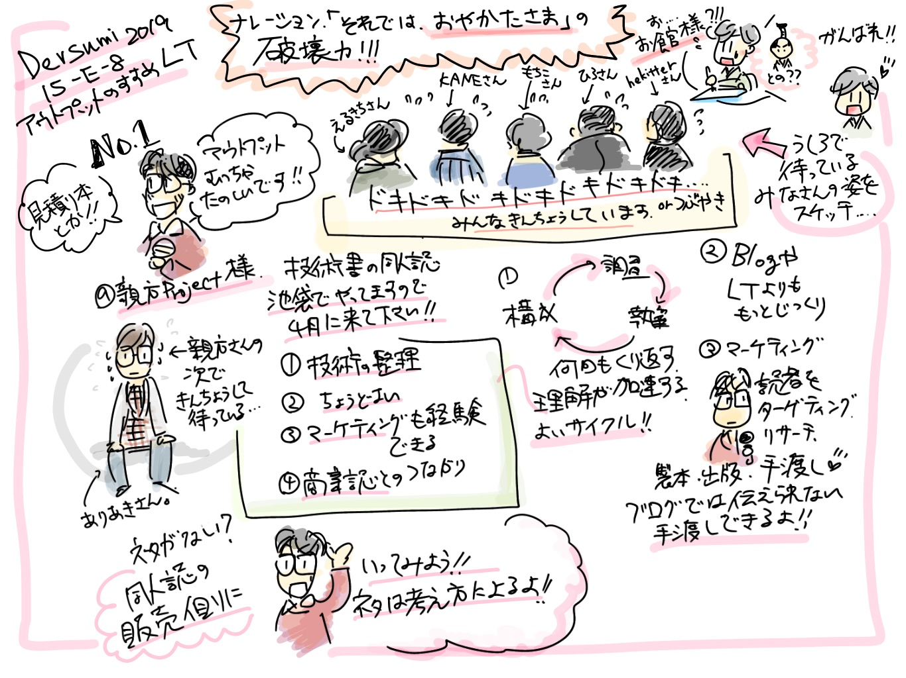

# 聴講中のインプットとアウトプット

カンファレンス聴講中は聴講中はインプットとアウトプットが同時に行われます。聞くだけなのだからインプットだけじゃないの？と思われるかもしれませんが、Twitter実況などのその場でのアウトプット、あるいは後日の感想やブログなどのかたちでのアウトプットがあります。

カンファレンスに参加することでたくさんのインプットを得られるのはある意味で当然ですが、アウトプットもそれと同じくらい重要です。むしろ意図的に行わないと、または習慣化されないとできないという意味では、アウトプットの方にも同じくらい注目することも必要かもしれません。もちろんアウトプットすることをプレッシャーに感じてしまい、足が遠のいたり、インプットに集中できなくなることは本末転倒ですし、残念ですから、まずはインプットに集中しましょう。

## アウトプットするメリット
インプットしながらアウトプットするメリットはいくつもあります。他の章にもさまざまなメリットが記載されていますので、そちらも参照いただくとして、多少重複すること理解しつつ、改めて整理しましょう。

* 備忘録になる
* 噛み砕き整理される
* 質問や感想として登壇者に届く
* 参加者、関係者の財産になる
* リアルタイムな熱量を伝える
* カンファレンスを盛り上げる

上ふたつは自分にとってのメリット、中のふたつはセッション参加者全てにとってのメリット、最後のふたつはカンファレンス全体へのメリットです。

### 自分へのメリット
Twitter実況などがわかりやすい例になりますが、自分が講演を「どう受け取った／理解した」のかをその場でアウトプットすることで、自分が得た知識を可視化することができます。これは後から見返すこともできますし、公開された資料だけではわからないような微妙なニュアンスや口頭だけで発言されたような内容も残すことができます。そして、そのツイートは単なる受け売りではなく、自分が一度噛み砕いた内容ですから、エッセンスの抽出や取捨選択など、自分にヒット／フックした内容です。ですから、単に「聞いた内容」ではなく、既に血肉となりうる内容です。講演を聞くだけでは目の前に美味しそうなご馳走が並んでいる状態ですが、アウトプットを行うことでそれは口／胃に届いた状態と考えることができます。これから消化され、あなたの体の一部に変わります。内容を「噛み砕く」というのは非常に的を射た表現です。美味しいものもそのまま飲み込んでは消化不良になります。ちゃんと噛みましょう。

また、後日参加ブログなどとしてまとめる時にも役に立つでしょう。ブログの貼り付け機能を使って一連のツイートを並べるだけでも参加ブログとなりますし、一番の肝になる（あるいはエモい）ツイートを貼りつつ、他は再度組み立て直すといった形でまとめると、さらに体系立てた整理ができることでしょう。Twitter実況というリアルタイムのアウトプットと、ブログなどの少しタイムラグのあるアウトプットを組み合わせることで、同じ内容を繰り返しインプットしつつ、アウトプットを増やすことができます。インプットの効果を何倍にもあげつつ、労力は単一のアウトプットの1.5倍くらいで、成果は２倍以上のアウトプットが得られることでしょう。

### セッション参加者へのメリット
アウトプットを行うことで、質問や感想として運営や登壇者にリアルタイムに届くことがあります。たいていの場合セッションの最後に数分間の質疑応答タイムが確保されています。オフラインカンファレンスでは会場内から挙手し質疑応答が行われます。これに対しオンラインセッションでは、Twitterで流れる質問やコメントを司会者または登壇者本人がチェックして回答してくれることがあります。したがって、セッションの後半で質問をTweetしておくことで、直接質問することができます。リアルタイムで拾われなくても、後から直接回答してくれる場合もあります。大抵の登壇者は登壇後（あるいは登壇中に？）タイムラインを眺め、自分の登壇に言及しているTweetにいいねをつけて回ったりします。ここで質問を見つけたら、それに回答してくれる、あるいはお礼がくる可能性があります。

そして、こういった登壇者のやりとりは、そのセッションを見た人の共有財産になります。あなたが疑問に思ったことはきっと他の人も同じように疑問に思う内容です。それが登壇者に拾われ、回答があったとすれば、聴講者が共通して持つ疑問に対する回答となるのです。

あなたがコメントしなくても誰かがするからいいや、と思ってはもったいないです。想像以上にTwitter実況／コメントをする人は少ないです。数十人が聴いているはずのセッションでも、実況しているのは2〜3人なんてことはよくあります。ですので、せっかく実況をしているなら、気軽にコメントしましょう。他の人が同じような質問をしていても気にする必要はありません。同じような質問がくるということは、なおさら聴講者の共通する質問・疑問であるということ。また、うまく回答として拾われたら、それだけたくさんの人の目に触れるということ。講演自体も価値あるものですが、質疑でのコメント、補足などはとても価値があります。そしてそれは後日登壇資料が公開されたとしてもそこには出てきません。後日アーカイブ配信で見た人も見れるなど、大きな価値をもたらします。登壇者にとっても、疑問が生じるポイントがわかりますから、次の登壇へのブラッシュアップや補足といった形でポジティブなフィードバックとして活用することができます。

アウトプットの結果として疑問が拾われる、そしてその質疑応答は、セッション関係者全員にメリットをもたらします。

### カンファレンスを盛り上げる
カンファレンス関係のTweetやブログが多いと、盛り上がっている感が出ます。盛り上がっている感が出ると、人が集まってきます。

リアルタイムでは知らなかったカンファレンスでも、TLで盛り上がっていることを見かけて、またブログを見て、アーカイブ配信を見る、次回は参加してみる、といった形で参加者を増やす効果もあります。

## アウトプットのかたち
アウトプットにはさまざまな形態があります。

* Twitter
* ブログ
* グラレコ
* 参加レポートをミーティングで共有する

Twitterやブログについては他の章に詳細ややり方がありますのでここでは省略します。

### グラレコ

カンファレンス参加、聴講したセッションの記録を「イラスト」として記録する手法を、グラレコ（グラフィックレコーディング）といいます。例として、本章筆者が過去にとあるカンファレンスで登壇した時、あきこさん@akiko_pusuに描いていただいだグラレコ[^grarec]を載せます

2019年2月開催のデブサミ（Developers Summit 2019)において、LTセッション[^devsumi]を１コマいただき、登壇した時のものです。

セッションの内容や空気感までグラレコでまとめていただき、とても嬉しかったことを今でも覚えています。そして、それをきっかけに、今回アウトプットの一つの形として、グラレコについて書いていただけないかお願いするに至りました。ことばや線でもいいんです！描いてシェアして伝えてみよう！の章をぜひ読んでみてください。

緊張している登壇者の雰囲気含めて素敵にまとめていただいています。自分の登壇をまとめたグラレコがあれば、著者は間違いなく喜びます。

文字だけでも（イラストはなくても）手書きで内容をまとめるだけでも十分にグラレコと言えます。タブレットの手書きノート機能、あるいは紙に描いて写真としてアップロードするといった形でも良いでしょう。描いたものはぜひイベント・セッションのハッシュタグ付きで流してください。

[^devsumi]: アウトプットのススメ　～技術同人誌・LT登壇・Podcast～ https://event.shoeisha.jp/devsumi/20190214/session/2007/

[^grarec]: https://twitter.com/akiko_pusu/status/1096403963140726784

また、グラレコの大きなメリットの一つは、スライドのキーになるような図や説明をイラストの形で短時間でアウトプットできることです。先の図では、調査、執筆、構成のループについて（イラストの中央付近）を取り上げていただいていますが、これを例に取り上げましょう。ループが回る、という登壇者の主張があったとして、これを文字で書こうとするとなんとなくわかりづらくなってしまいます。テキストとして記録しようと思った時、その三つのキーワードをどう並べるかといったところにストレスを感じてしまいます。テキストエディタでこのループを再現することを考えてみてください。なかなかしんどいですよね。私は、「アウトプットの帯域」と呼んでいますが、同じ情報量を記録するまでの速度や労力が手書きの方が圧倒的に大きくなります。

それ以外にも、配置や強弱を付けやすく、１次元的な情報である文字羅列に対し、二次元的、あるいは強弱を含めて三次元的に情報を整理することができる、素晴らしい方法だと考えます。

なお、イラストとしてまとめるにあたって、そこにはイラストそのものの上手い下手は関係ありません。図形と文字だけでも十分にグラレコです。さきほど例としてとても素敵なグラレコを載せましたが、グラレコのハードルをあげる意図はありません。

聴講に集中するために、制約の大きいPCの文字起こしではなく、手書き、あるいは手書きに感覚の近いタブレットでのグラレコをおすすめします。

### 参加レポートを社内・ミーティングで共有する
参加レポートを社内へ共有してみませんか？

Slackの雑談チャンネルなどで雑談のきっかけとして、あるいはチームミーティングで話してみませんか？カンファレンスの概要、規模やセッションの傾向、内容、あるいはあなたがインプレッションを得たセッション、みんなの役に立ちそうなセッションの情報、概要を共有します。

ブログでまとめた内容があればそれを流用することもできます。手っ取り早くやるなら、ブログのURL貼っても良いでしょう。コメントする時間があれば、どれだけ楽しかった、学びがあったかを熱く語っても良いでしょう。

有料のカンファレンスに参加費会社負担で参加した時はできるだけレポートを作りましょう。その費用負担は福利厚生かもしれませんが、さらにその知見を皆で共有することで、費用の何倍もの実利を得ることができるかもしれません。会社の雰囲気やさまざまな前提条件によってすぐ使えるモノばかりではないでしょうが、共有しておくことでいざという時に引っ張り出せたり、アレンジやカスタマイズして活用できるかもしれません。チームの誰かが、新しいテクニックのとっかかりとして活用できることもあるかもしれません。また、社内にフィードバックされ、それが効果を生むことがわかれば補助制度がより拡充されるかもしれません。逆に参加するだけ参加して（会社としておもてむき）何も得るものがなかったら、補助制度自体がなくなってしまうかもしれません。

あなたが共有を始めたら、後に続く人もいるでしょう。いつの間にかみんなが気軽に、でもさまざまなイベントについて網羅的に共有をするような風土ができるかもしれません。そうすれば、インプット先が数倍に増えます。自分が参加しなくても、他の人がカンファレンスの知見のエッセンスを持ってきてくれるのです。原典にあたることも重要ですが、他の人が噛み砕いたあとのものを美味しくいただくことも効果的でしょう。同じ会社、同じチームであれば思考も近しくなり、共有されたカンファレンスで得た知識、テクニックの役に立つことも増えます。

## アウトプットのデメリットはない
カンファレンスでインプットしたことをアプトプットすることにデメリットはありません。

時間が少しかかる？整理・アウトプットする手間がかかる？それは否定はできませんが、慣れれば手間と感じる部分はどんどん減っていきます。それでいて、自分にも、カンファレンス関係者にも、チームにも有益な点がたくさんあります。まずはTwitterから、アウトプットを始めてみませんか？